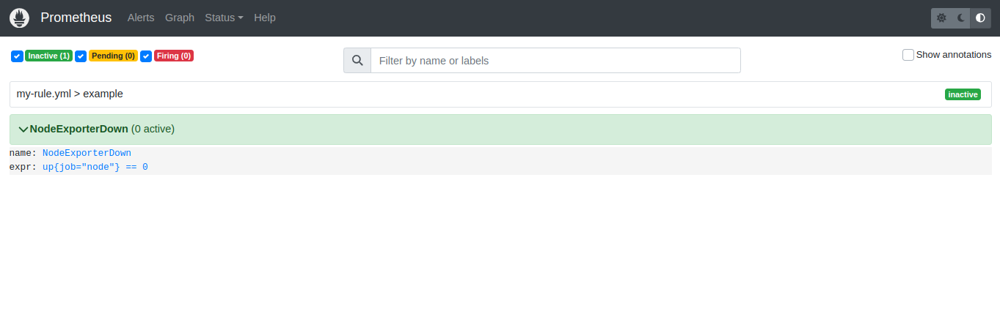
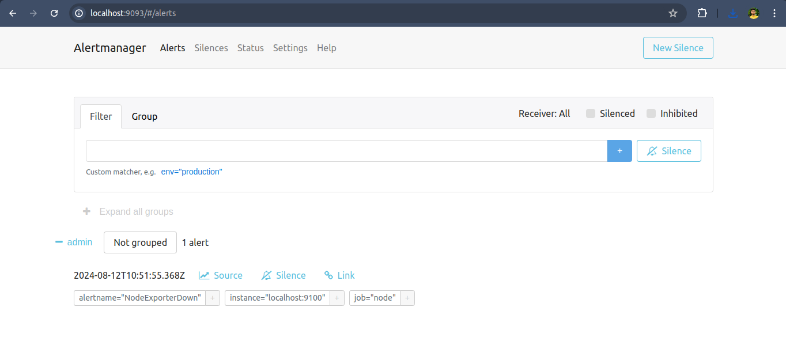
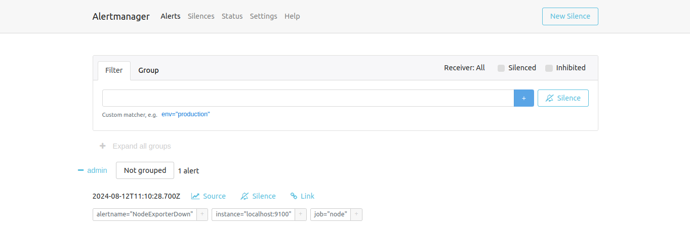
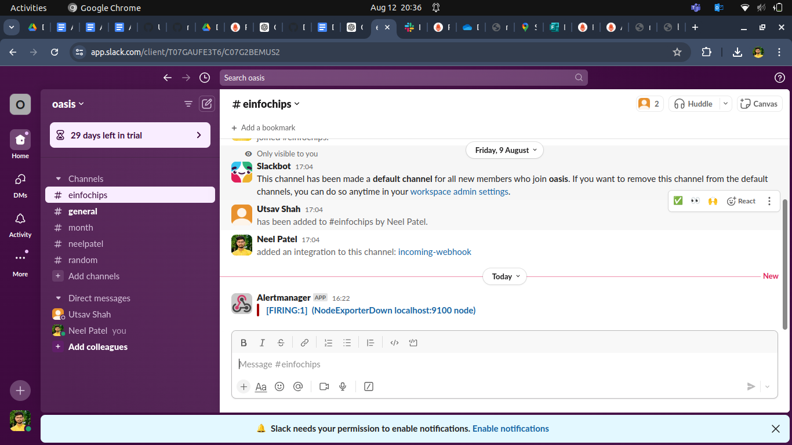

### 

**Project 01**

### **Project Breakdown**

#### **1\. Configuring Jobs and Targets**

* **Task:** Set up a Prometheus server to monitor multiple services running on different nodes.  
* **Deliverables:**  
  * Configure Prometheus with jobs for monitoring different services like web servers, databases, and system metrics.  
  * Define static and dynamic targets using file-based and service discovery methods (e.g., Consul or Kubernetes).

 + localhost:9100 for node exporter
 + Add node to prometheus.yml
    ```yml
    - job_name: 'node'
      static_configs:
        - targets: ['localhost:9100']
    ```

#### **2\. Using Exporters (Node Exporter)**

* **Task:** Use Node Exporter to monitor system-level metrics like CPU, memory, disk usage, and network statistics.  
* **Deliverables:**  
  * Install and configure Node Exporter on all nodes.  
  * Ensure Node Exporter metrics are being correctly scraped by Prometheus.

    + Add node exporter in VM
    1. Connect to VM
    2. wget https://github.com/prometheus/node_exporter/releases/download/v1.7.0/node_exporter-1.7.0.linux-amd64.tar.gz
    3. tar xvf node_exporter-1.7.0.linux-amd64.tar.gz
    4. cd node_exporter-1.7.0.linux-amd64
    5. ./node_exporter

    

#### **3\. Hands-on Exercise: Setting Up Exporters**

* **Task:** Configure at least two different types of exporters (e.g., Node Exporter and MySQL Exporter) and integrate them with Prometheus.  
* **Deliverables:**  
  * Demonstrate successful data collection from both exporters.  
  * Create a basic Prometheus dashboard to visualize key metrics from these exporters.


    1. wget https://github.com/prometheus/mysqld_exporter/releases/download/v0.15.1/mysqld_exporter-0.15.1.linux-amd64.tar.gz
    2. tar xvf mysqld_exporter-0.15.1.linux-amd64.tar.gz
    3. cd mysqld_exporter-0.15.1.linux-amd64
    4. in local add this configuration
    ```yml
    - job_name: 'mysql'
      static_configs:
        - targets: ['3.1*******:9104']
    ```

#### **4\. Introduction to PromQL**

* **Task:** Learn and implement basic PromQL queries to extract meaningful data from the metrics collected.  
* **Deliverables:**  
  * Write basic queries to retrieve metrics like average CPU usage, memory consumption, and disk I/O over time.

    +  Current CPU Usage
    ```
    rate(node_cpu_seconds_total[5m])
    ```

    + disk Usage in Percentage
    ```
    100 - (node_filesystem_free_bytes{mountpoint="/"} / node_filesystem_size_bytes{mountpoint="/"} * 100)
    ```

#### **5\. Basic Queries (Selectors, Functions, Operators)**

* **Task:** Create PromQL queries using selectors, functions, and operators to filter and manipulate time-series data.  
* **Deliverables:**  
  * Write PromQL queries to calculate the 95th percentile of CPU usage.  
  * Use functions like `rate()`, `increase()`, and `histogram_quantile()` to perform more complex analysis.

    + Aggregating CPU Usage Across All Cores
    ```
    sum(rate(node_cpu_seconds_total[5m])) by (instance)
    ```

#### **6\. Advanced Queries and Aggregations**

* **Task:** Perform advanced data aggregation using PromQL.  
* **Deliverables:**  
  * Write queries to calculate the total memory usage across all nodes.  
  * Aggregate data to find the maximum disk space usage among all nodes.

    + calculate the total memory usage across all nodes
    ```
    sum(node_memory_MemTotal_bytes - node_memory_MemAvailable_bytes)
    ```
    + the maximum disk space usage among all nodes

    ```
    max(node_filesystem_size_bytes - node_filesystem_free_bytes)
    ```

#### **7\. Configuring Alertmanager**

* **Task:** Set up Alertmanager to handle alerts generated by Prometheus.  
* **Deliverables:**  
  * Configure Alertmanager with Prometheus.  
  * Create routing rules to manage alert notifications based on severity and service type.

  + steps to add alertmanager

    1. installing the alertmanager 
      ```
      wget https://github.com/prometheus/alertmanager/releases/download/v0.27.0/alertmanager-0.27.0.linux-amd64.tar.gz
      ```
    2. unzip the files
    ```
    tar -xvf alertmanager-0.27.0.linux-amd64.tar.gz 
    cd alertmanager-0.27.0.linux-amd64/
    ```
    3. Run the alertmanager
    ```
    ./alertmanager
    ```
    

  + alertmanger.yml
  ```yml
  route:
    receiver: admin

  receivers:
  - name: admin
    slack_configs:
      - channel: "#einfochips"
        api_url: 'https://hooks.slack.com/services/T07GAUFE3T6/B07G63Y0SAZ/ Sd3YyPKvALYD8WZcVerT5YSZ'
  ```

#### **8\. Writing Alerting Rules**

* **Task:** Write custom alerting rules in Prometheus to trigger alerts based on specific conditions.  
* **Deliverables:**  
  * Create alerting rules for high CPU usage, memory leaks, and disk space running low.  
  * Ensure alerts are correctly generated and sent to Alertmanager.
  
  + custome alertmanager to check node_exporter is up or down
  + my-rule.yml
  ```yml
  groups:
  - name: example
    rules:
      - record: job:node_cpu_seconds:avg_idle
        expr: avg without(cpu)(rate(node_cpu_seconds_total{mode="idle"}[5m]))

      - alert: NodeExporterDown
        expr: up{job="node"} == 0 
  ```

  + rules for high CPU usage, memory leaks, and disk space running low
  ```yml
  groups:
  - name: CPUAlerts
    rules:
    - alert: HighCPUUsage
      expr: sum(rate(node_cpu_seconds_total{mode!="idle"}[5m])) by (instance) > 0.9
      for: 5m
      labels:
        severity: critical
      annotations:
        summary: "High CPU usage on {{ $labels.instance }}"
        description: "CPU usage is above 90% for more than 5 minutes."
  ```

#### **9\. Setting Up Notification Channels (Email, Slack, etc.)**

* **Task:** Integrate Alertmanager with multiple notification channels like Email and Slack.  
* **Deliverables:**  
  * Set up Email notifications for critical alerts.  
  * Integrate Slack for real-time alerts and notifications.

    + Slack 
    ```yml
    route:
      receiver: admin

    receivers:
    - name: admin
      slack_configs:
      - channel: "#channel-name"
        api_url: "Link"
    ```

  

#### **10\. Hands-on Exercise: Creating Alerts**

* **Task:** Test the entire alerting pipeline by creating and triggering custom alerts.  
* **Deliverables:**  
  * Simulate a scenario where a node exceeds 90% CPU usage and ensure alerts are triggered and sent to both Email and Slack.  
  * Validate the alerts in both notification channels.

    + my-rule.yml
    ```yml
    groups:
    - name: example
      rules:
        - record: job:node_cpu_seconds:avg_idle
          expr: avg without(cpu)(rate(node_cpu_seconds_total{mode="idle"}[5m]))

        - alert: NodeExporterDown
          expr: up{job="node"} == 0 
    ```

    

    


