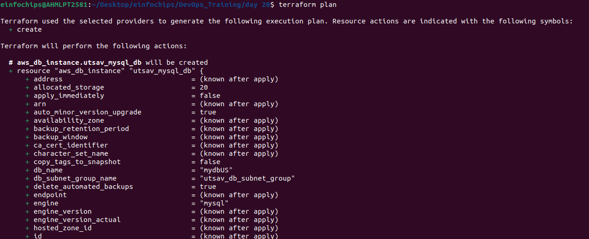
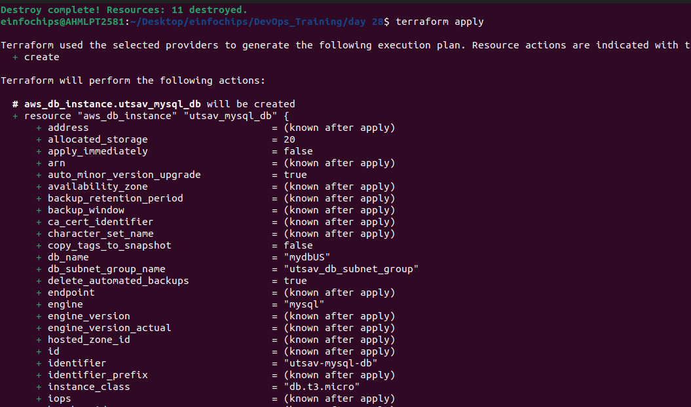
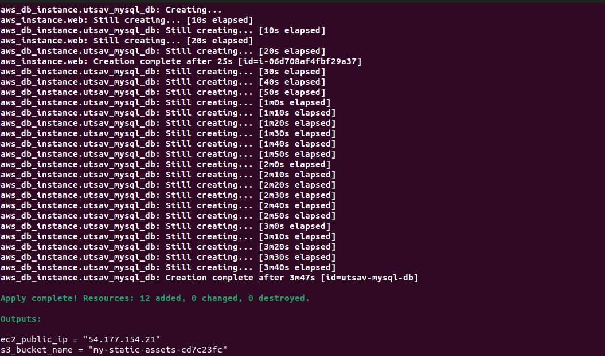
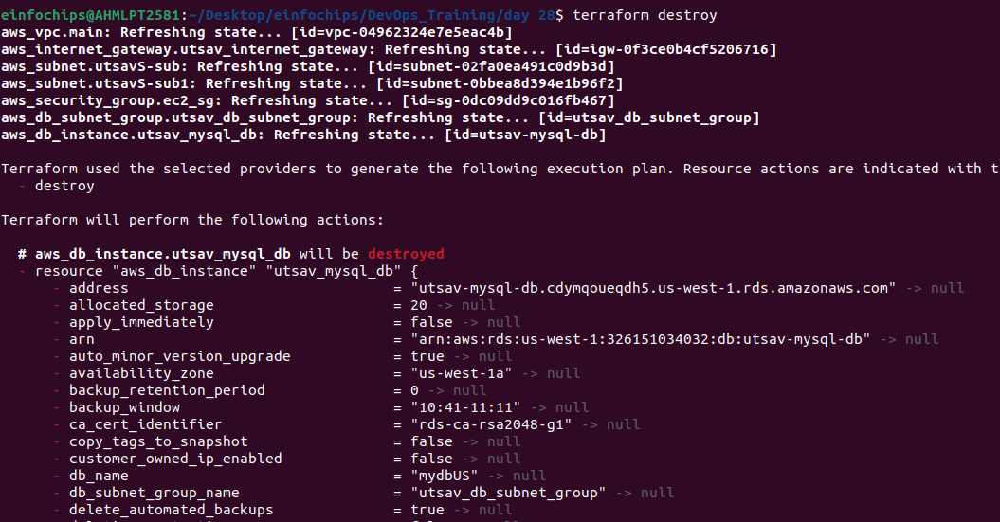

### **Project: Deploying a Multi-Tier Architecture Application on AWS using Terraform**

#### **Project Objective:**

This project will assess your ability to deploy a multi-tier architecture application on AWS using Terraform. The deployment will involve using Terraform variables, outputs, and change sets. The multi-tier architecture will include an EC2 instance, an RDS MySQL DB instance, and an S3 bucket.

#### **Project Overview:**

You are required to write Terraform configuration files to automate the deployment of a multi-tier application on AWS. The architecture should consist of:

#### **Key Tasks:**

1. **Setup Terraform Configuration:**  
   * **Provider Configuration**:  
     * Configure the AWS provider to specify the region for deployment.  
     * Ensure the region is parameterized using a Terraform variable.  
   * **VPC and Security Groups**:  
     * Create a VPC with a public subnet for the EC2 instance.  
     * Define security groups allowing HTTP and SSH access to the EC2 instance, and MySQL access to the RDS instance.  
   * **EC2 Instance**:  
     * Define the EC2 instance using a `t2.micro` instance type.  
     * Configure the instance to allow SSH and HTTP access.  
     * Use Terraform variables to define instance parameters like AMI ID and instance type.  
   * **RDS MySQL DB Instance**:  
     * Create a `t3.micro` MySQL DB instance within the same VPC.  
     * Use Terraform variables to define DB parameters like DB name, username, and password.  
     * Ensure the DB instance is publicly accessible, and configure security groups to allow access from the EC2 instance.  
   * **S3 Bucket**:  
     * Create an S3 bucket for storing static files or configurations.  
     * Allow the EC2 instance to access the S3 bucket by assigning the appropriate IAM role and policy.  
   * **Outputs**:  
     * Define Terraform outputs to display the EC2 instance’s public IP address, the RDS instance’s endpoint, and the S3 bucket name.  
2. **Apply and Manage Infrastructure:**  
   * **Initial Deployment**:  
     * Run `terraform init` to initialize the configuration.  
     * Use `terraform plan` to review the infrastructure changes before applying.  
     * Deploy the infrastructure using `terraform apply`, and ensure that the application server, database, and S3 bucket are set up correctly.  
   * **Change Sets**:  
     * Make a minor change in the Terraform configuration, such as modifying an EC2 instance tag or changing an S3 bucket policy.  
     * Use `terraform plan` to generate a change set, showing what will be modified.  
     * Apply the change set using `terraform apply` and observe how Terraform updates the infrastructure without disrupting existing resources.  

     
     

3. **Testing and Validation:**  
   * Validate the setup by:  
     * Accessing the EC2 instance via SSH and HTTP.  
     * Connecting to the MySQL DB instance from the EC2 instance.  
     * Verifying that the EC2 instance can read and write to the S3 bucket.  
   * Check the Terraform outputs to ensure they correctly display the relevant information.  

     

4. **Resource Termination:**  
   * Once the deployment is complete and validated, run `terraform destroy` to tear down all the resources created by Terraform.  
   * Confirm that all AWS resources (EC2 instance, RDS DB, S3 bucket, VPC) are properly deleted.  
     

