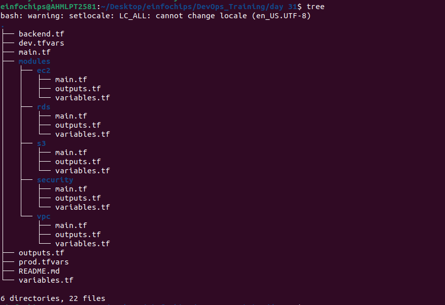
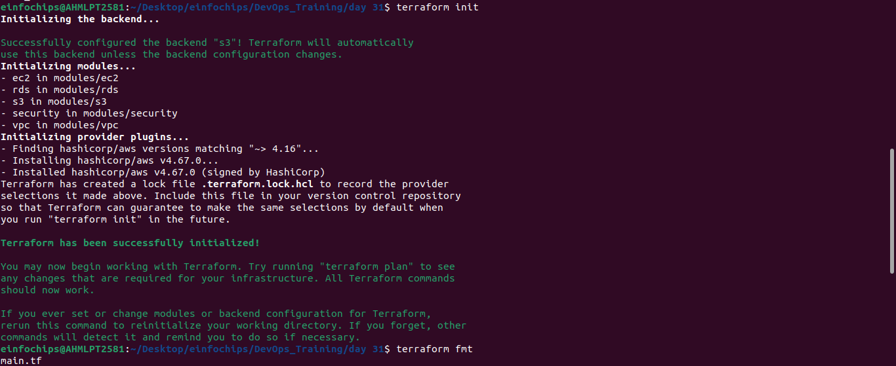
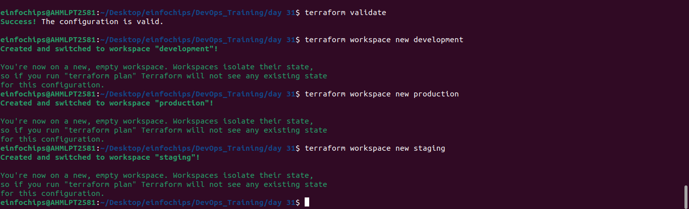
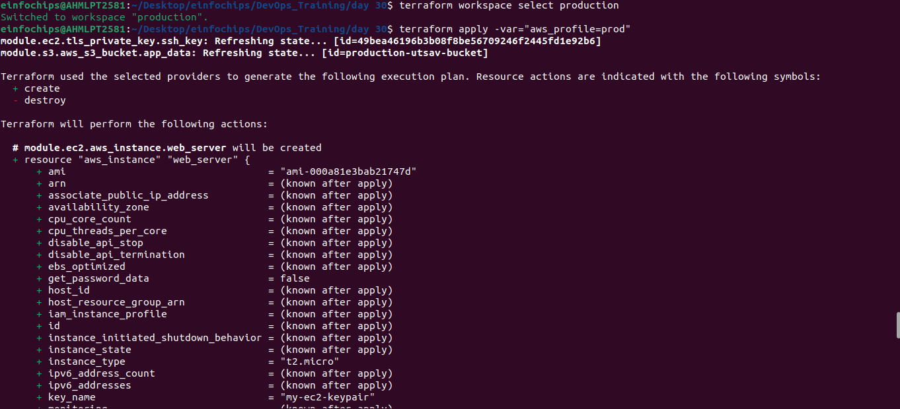

### **Automation (IaaC) Terraform on AWS Assessment Project**

#### **Project Overview**

### **Project Requirements**

#### **1\. Infrastructure Design**

The project will involve deploying a basic 3-tier web application architecture, which includes the following components:

1. **VPC**: Create a Virtual Private Cloud (VPC) with public and private subnets across two availability zones.  
2. **Security Groups**: Define security groups to control inbound and outbound traffic for the application and database tiers.  
3. **EC2 Instances**: Deploy EC2 instances in the public subnets for the web servers (Application Tier).  
4. **RDS Instance**: Deploy an RDS MySQL instance in the private subnet for the database (Database Tier).  
5. **S3 Bucket**: Create an S3 bucket to store static files, with versioning enabled.  
6. **Elastic IPs**: Assign Elastic IPs to the EC2 instances.  
7. **IAM Role**: Create an IAM role with the necessary permissions and attach it to the EC2 instances.

#### **2\. Terraform State Management**

● Implement **remote state storage** using an S3 bucket to store the Terraform state file.  
● Use **DynamoDB** for state locking to prevent concurrent modifications.

#### **3\. Variables and tfvars**

● Define **input variables** for resources like VPC CIDR, instance types, database username/password, and S3 bucket names.  
● Use `.tfvars` files to pass different configurations for environments (e.g., `dev.tfvars`, `prod.tfvars`).

#### **4\. Modules**

● Break down the infrastructure into reusable **modules**:

○ **VPC Module**: Manage VPC, subnets, and routing tables.

○ **EC2 Module**: Configure and launch EC2 instances.

○ **RDS Module**: Set up the RDS MySQL database.

○ **S3 Module**: Handle S3 bucket creation with versioning.

○ **IAM Module**: Create and manage IAM roles and policies.

#### **5\. Functions**

● Use Terraform **functions** to dynamically configure:

○ The names of resources using `format` and `join` functions.

○ Subnet CIDRs using `cidrsubnet`.

○ Lookup values for AMI IDs using `lookup` function.

#### **6\. Workspaces**

● Create **workspaces** for different environments (e.g., `development`, `staging`, `production`).  
● Deploy the infrastructure in each environment using the appropriate workspace.

#### **7\. Lifecycle Rules**

● Implement **lifecycle rules** to:

○ **Prevent resource deletion**: Ensure certain resources, like the RDS database, are not accidentally deleted (`prevent_destroy`).

○ **Ignore changes** to specific resource attributes (e.g., S3 bucket tags) using `ignore_changes`.

### **Project Steps**

#### **Step 1: Setup Remote State and Locking**

1. Create an S3 bucket for storing Terraform state.  

```
aws s3 mb s3://neel-terraform-bucket --region us-east-
```

2. Create a DynamoDB table for state locking. 

```
aws dynamodb create-table \
    --table-name neel-dynamodb-table \
    --attribute-definitions AttributeName=LockID,AttributeType=S \
    --key-schema AttributeName=LockID,KeyType=HASH \
    --provisioned-throughput ReadCapacityUnits=5,WriteCapacityUnits=5 \
    --region us-east-2
```

3. Configure the backend in Terraform to use the S3 bucket and DynamoDB table.

```
terraform {
  backend "s3" {
    bucket         = "neel-terraform-bucket"
    key            = "dev/terraform.tfstate"
    region         = "us-east-2"
    encrypt        = true
    dynamodb_table = "neel-dynamodb-table"
  }
}
```

#### **Step 2: Develop and Organize Modules**

1. Develop separate modules for VPC, EC2, RDS, S3, and IAM.  
2. Place each module in a separate directory with `main.tf`, `variables.tf`, and `outputs.tf`.



#### **Step 3: Define Variables and tfvars Files**

1. Define variables in `variables.tf` files within each module.  
2. Create a `terraform.tfvars` file with default values.  
3. Create separate environment-specific `.tfvars` files (e.g., `dev.tfvars`, `prod.tfvars`).

+ dev.tfvars
```
ami_id               = "ami-************"
instance_type     = "t2.micro"
```

#### **Step 4: Implement Workspaces**

1. Initialize Terraform and create workspaces (`development`, `staging`, `production`).  
2. Deploy infrastructure in each workspace using the appropriate `.tfvars` file.






#### **Step 5: Deploy the Infrastructure**

1. Use the `terraform apply` command to deploy the infrastructure in each workspace.  
2. Verify the deployment by accessing the EC2 instances and ensuring the application is running.




#### **Step 6: Implement Lifecycle Rules**

1. Modify the Terraform code to add lifecycle rules for critical resources.  
2. Apply the changes and verify that the lifecycle rules are in effect.

- s3/main.tf
```
resource "aws_s3_bucket" "main" {
  bucket = "neel-bucket-s3"

  tags = {
    Name = "neel-s3-bucket"
  }
  lifecycle {
    ignore_changes = [tags]
  }
}
```

- rds/main.tf
```
resource "aws_db_subnet_group" "main" {
  name       = "neel-subnet-group"
  subnet_ids = var.private_subnet_ids
}

resource "aws_db_instance" "mysql" {
  identifier           = "neel-mysql-db"
  allocated_storage    = 20
  engine               = "mysql"
  engine_version       = "5.7"
  instance_class       = "db.t3.micro"
  db_name              = var.db_name
  username             = var.db_username
  password             = var.db_password
  db_subnet_group_name = aws_db_subnet_group.main.name
  vpc_security_group_ids = [var.db_sg_id]
  skip_final_snapshot  = true

  lifecycle {
    prevent_destroy = true
  }
}

```


#### **Step 7: Cleanup**

1. Destroy the infrastructure in each workspace using `terraform destroy`.  
2. Ensure that resources marked with `prevent_destroy` are not deleted.


